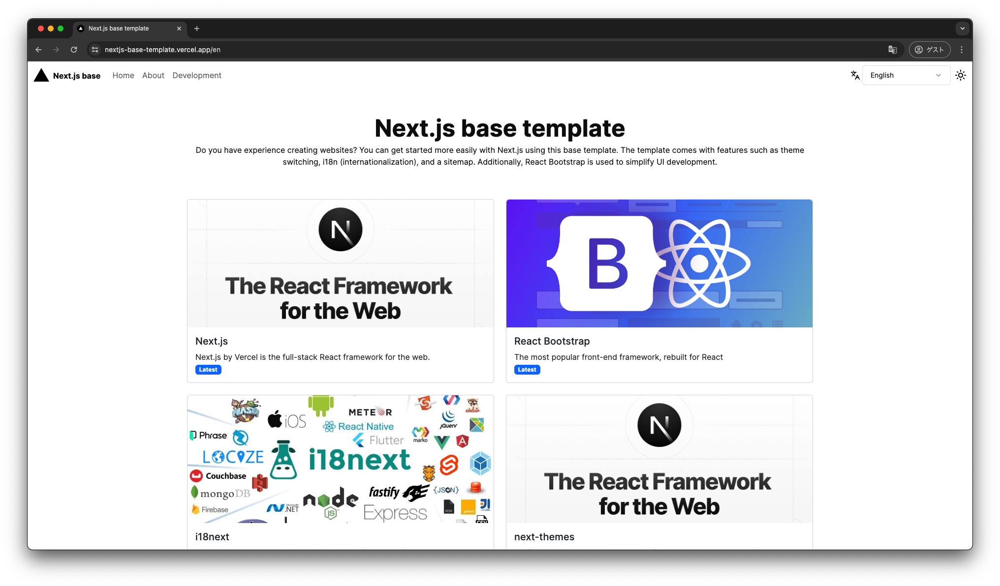
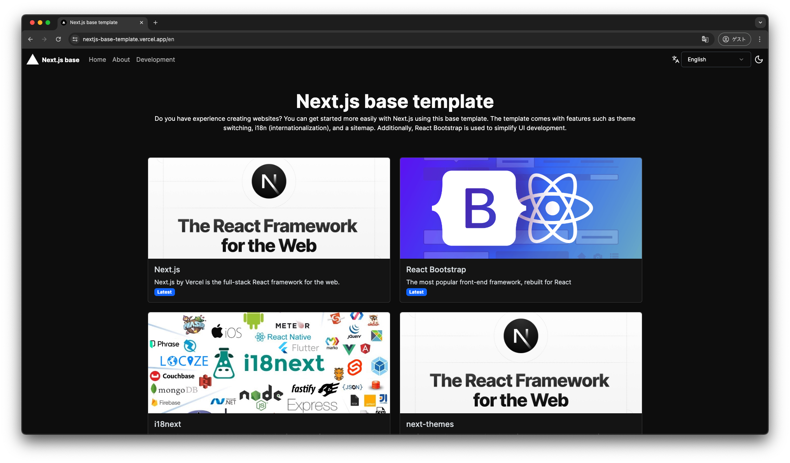

<p align="center">
  <a href="https://nextjs-base-template.vercel.app/">
    <picture>
      <source media="(prefers-color-scheme: dark)" srcset="https://assets.vercel.com/image/upload/v1662130559/nextjs/Icon_dark_background.png">
      
    </picture>
    <h1 align="center">Next.js base template</h1>
  </a>
</p>

<p align="center">
  <a aria-label="Vercel logo" href="https://vercel.com">
    
  </a>
  <a aria-label="NPM version" href="https://www.npmjs.com/package/next/">
    
  </a>
  <a aria-label="License" href="https://github.com/Fun117/nextjs-base-template/blob/main/LICENSE.txt">
    
  </a>
</p>

<p align="center">
  <a aria-label="README - English" href="./README.md">
    
  </a>
  <a aria-label="README - 日本語" href="./md/ja.md">
    
  </a>
</p>

<div align="center">
 
 
 
 
 
 
 
 
 
</div>

<p align="center">
  
  
</p>

# Next.js base template

This Next.js base template is designed as an easy starting point for Next.js projects. It comes with features such as theme switching, i18n (internationalization), and automatic sitemap generation, allowing developers to start their projects quickly.

## Key Features

- **Theme Switching**: Supports both light and dark modes.
- **i18n (Internationalization)**: Supports multiple languages.
- **Sitemap**: Automatically generates a sitemap for SEO.
- **React Bootstrap**: Uses React Bootstrap to facilitate UI development.

## Deploy your own

Deploy the example using [Vercel](https://vercel.com?utm_source=github&utm_medium=readme&utm_campaign=next-example) or preview live with [StackBlitz](https://stackblitz.com/github/fun117/nextjs-base-template)

[](https://vercel.com/new/clone?repository-url=https://github.com/Fun117/nextjs-base-template&project-name=nextjs-base-template&repository-name=nextjs-base-template)

## How to use

Execute [`git clone`](https://github.com/vercel/next.js/tree/canary/packages/create-next-app) with to bootstrap the example:

```bash
git clone https://github.com/fun117/nextjs-base-template.git
```

Deploy it to the cloud with [Vercel](https://vercel.com/new?utm_source=github&utm_medium=readme&utm_campaign=next-example) ([Documentation](https://nextjs.org/docs/deployment)).
