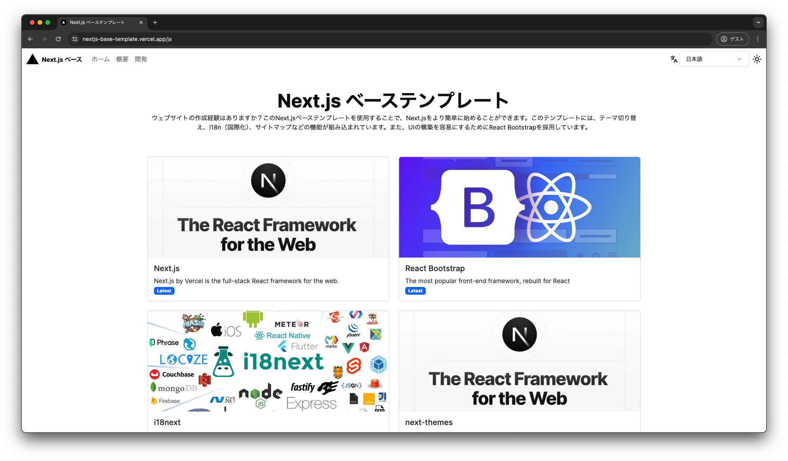
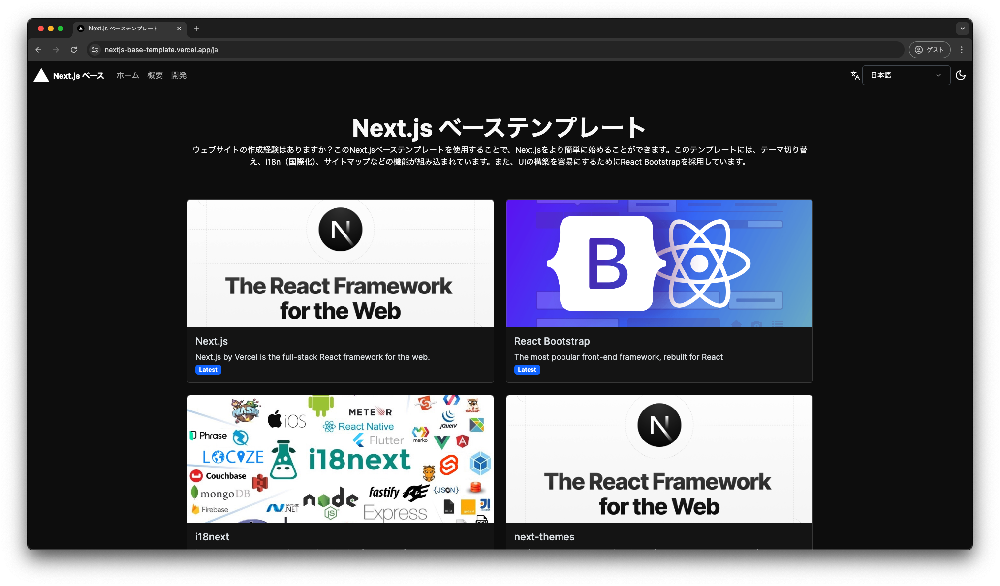

<p align="center">
  <a href="https://nextjs-base-template.vercel.app/">
    <picture>
      <source media="(prefers-color-scheme: dark)" srcset="https://assets.vercel.com/image/upload/v1662130559/nextjs/Icon_dark_background.png">
      
    </picture>
    <h1 align="center">Next.jsベーステンプレート</h1>
  </a>
</p>

<p align="center">
  <a aria-label="Vercel logo" href="https://vercel.com">
    
  </a>
  <a aria-label="NPM version" href="https://www.npmjs.com/package/next/">
    
  </a>
  <a aria-label="License" href="https://github.com/Fun117/nextjs-base-template/blob/main/LICENSE.txt">
    
  </a>
</p>

<p align="center">
  <a aria-label="README - English" href="../README.md">
    
  </a>
  <a aria-label="README - 日本語" href="./ja.md">
    
  </a>
</p>

<p align="center">
  
  
</p>

# Next.js ベーステンプレート

この Next.js ベーステンプレートは、Next.js を始めるための簡単なスタートポイントとして設計されています。テーマ切り替え、i18n（国際化）、サイトマップなどの機能が事前に組み込まれており、開発者が迅速にプロジェクトを開始できるようになっています。

## 主な特徴

- **テーマ切り替え**: ライトモードとダークモードの切り替えが可能です。
- **i18n（国際化）**: 複数の言語をサポートしています。
- **サイトマップ**: SEO 対策としてサイトマップが自動生成されます。
- **React Bootstrap**: UI の構築を容易にするために React Bootstrap を採用しています。

## 自分自身でデプロイ

この例を使用して [Vercel](https://vercel.com?utm_source=github&utm_medium=readme&utm_campaign=next-example) でデプロイするか、[StackBlitz](https://stackblitz.com/github/fun117/nextjs-base-template) でライブプレビューを行ってください。

[](https://vercel.com/new/clone?repository-url=https://github.com/Fun117/nextjs-base-template&project-name=nextjs-base-template&repository-name=nextjs-base-template)

## 使い方

```bash
git clone https://github.com/fun117/nextjs-base-template.git
```

クラウドに [Vercel](https://vercel.com/new?utm_source=github&utm_medium=readme&utm_campaign=next-example) でデプロイしてください ([ドキュメント](https://nextjs.org/docs/deployment)).
